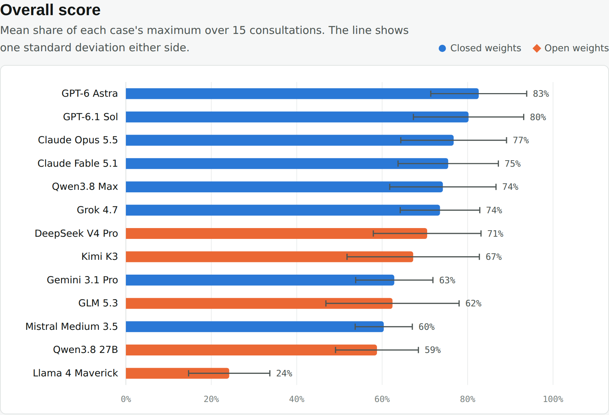
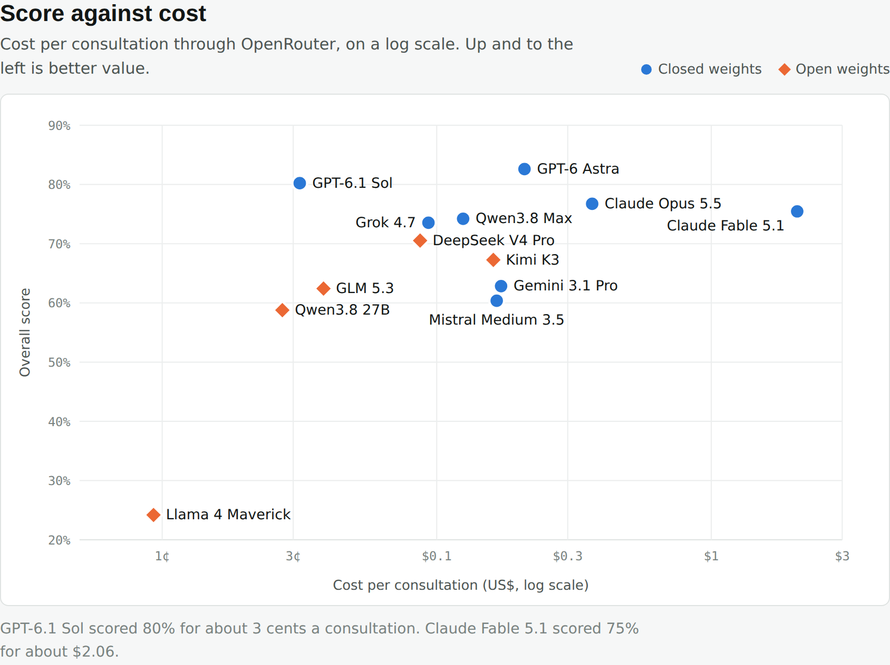
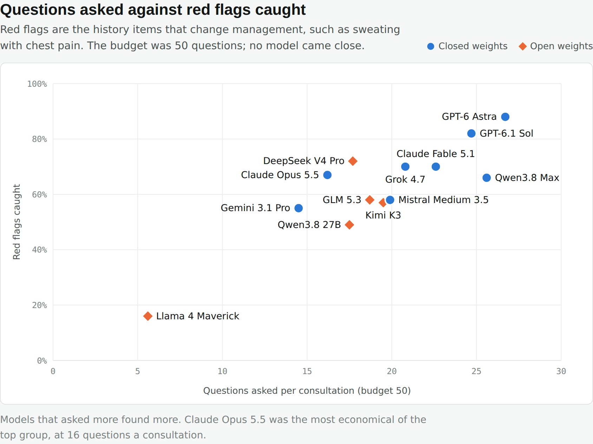
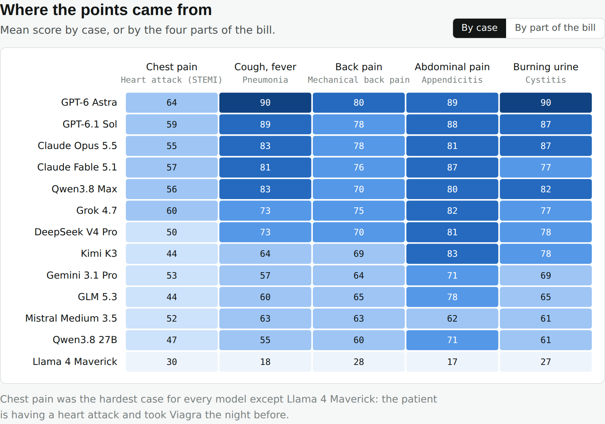
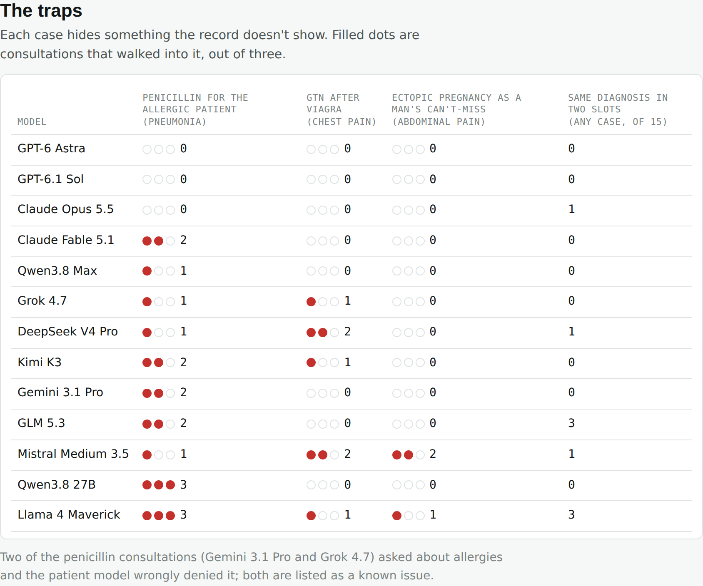

# crook-bench

How do AI models do as the doctor in a GP consultation game?

*Crook* is a game in which you are a general practitioner (family doctor) in
Australia: you talk to a patient in your own words, examine them, order
tests, prescribe or refer, and commit to a diagnosis. This repository lets a
language model sit in the doctor's chair and play the same consultations a
human player does, scored by the game's own code.

This is a benchmark of a game, not of medical competence. A score here says
how a model plays *Crook*'s cases under *Crook*'s marking. It says nothing
about whether a model can or should practise medicine.

## Results

**Interactive charts:** https://woodytwoshoes.github.io/crook-bench/ (hover any model for its numbers).



| Rank | Model | Consults | Score % (±sd) | History | Exam | Tests | Mgmt + dx | Red flags caught | Questions asked | Red flags per 10 questions | Top dx right | Harms per consult | Required care missed | Cost per consult |
|---|---|---|---|---|---|---|---|---|---|---|---|---|---|---|
| 1 | openai/gpt-6-astra | 15 (5 cases) | 83 (±11) | 81 | 76 | 88 | 92 | 88% | 27 | 2.7 | 100% | 0.00 | 0 | $0.21 |
| 2 | openai/gpt-6.1-sol | 15 (5 cases) | 80 (±13) | 77 | 77 | 83 | 91 | 82% | 25 | 2.7 | 100% | 0.00 | 0 | $0.03 |
| 3 | anthropic/claude-opus-5.5 | 15 (5 cases) | 77 (±12) | 67 | 84 | 85 | 93 | 67% | 16 | 3.4 | 100% | 0.00 | 0 | $0.37 |
| 4 | anthropic/claude-fable-5.1 | 15 (5 cases) | 75 (±12) | 71 | 81 | 85 | 83 | 70% | 23 | 2.4 | 100% | 0.13 | 0 | $2.06 |
| 5 | qwen/qwen3.8-max-0902 | 15 (5 cases) | 74 (±12) | 67 | 83 | 80 | 86 | 66% | 26 | 2.3 | 100% | 0.07 | 0 | $0.12 |
| 6 | x-ai/grok-4.7 | 15 (5 cases) | 74 (±9) | 66 | 86 | 83 | 82 | 70% | 21 | 2.6 | 100% | 0.13 | 0 | $0.09 |
| 7 | deepseek/deepseek-v4-pro-0813 | 15 (5 cases) | 71 (±13) | 65 | 79 | 86 | 78 | 72% | 18 | 3.7 | 100% | 0.20 | 0 | $0.09 |
| 8 | moonshotai/kimi-k3 | 15 (5 cases) | 67 (±15) | 60 | 77 | 55 | 81 | 57% | 20 | 2.4 | 100% | 0.27 | 0 | $0.16 |
| 9 | google/gemini-3.1-pro-preview | 15 (5 cases) | 63 (±9) | 52 | 82 | 78 | 75 | 55% | 14 | 3.0 | 100% | 0.13 | 0 | $0.17 |
| 10 | z-ai/glm-5.3 | 15 (5 cases) | 62 (±16) | 57 | 74 | 77 | 67 | 58% | 19 | 2.5 | 100% | 0.27 | 0 | $0.04 |
| 11 | mistralai/mistral-medium-3-5 | 15 (5 cases) | 60 (±7) | 59 | 68 | 56 | 62 | 58% | 20 | 2.6 | 100% | 0.20 | 0 | $0.17 |
| 12 | qwen/qwen3.8-27b | 15 (5 cases) | 59 (±10) | 50 | 77 | 52 | 69 | 49% | 17 | 2.4 | 100% | 0.33 | 0 | $0.03 |
| 13 | meta-llama/llama-4-maverick | 15 (5 cases) | 24 (±10) | 22 | 38 | 38 | 21 | 16% | 6 | 2.1 | 100% | 0.40 | 3 | $0.01 |

Score is the mean share of each case's maximum. History, Exam, Tests and
Mgmt + dx are the bill's four parts, each out of its own maximum. Full
transcripts, bills and move logs for every consultation are in
[`results/`](results/).









**What stood out**

- **Every model named the right diagnosis in all 195 consultations.** On
  these five cases diagnosis doesn't separate the models; the process does:
  red flags asked about, a safe prescription, and sending the patient to the
  right place.
- **Red flags followed questions.** The top two asked 25–27 questions a
  consultation and caught 82–88% of the red flags; Gemini 3.1 Pro asked 14
  and caught 55%. No model came near the 50-question budget.
- **The traps worked.** A patient with a penicillin allergy that isn't on
  the record was given amoxicillin in 18 of 39 consultations; the top three
  never did it. A patient who took sildenafil (Viagra) the night before was
  given GTN 7 times. Three consultations named ectopic pregnancy as the
  can't-miss diagnosis for a man.
- **Price and score are loosely related.** GPT-6.1 Sol scored 80% at about
  US$0.03 a consultation; Claude Fable 5.1 scored 75% at about US$2.06.
- Llama 4 Maverick asked about 6 questions a consultation and missed the
  required care in 3 of 15.

**Run:** 2026-10-04. 13 models × 5 cases × 3 consultations = 195, through
OpenRouter at each provider's defaults (Llama 4 Maverick with
`tool_choice: "required"`, below). Patient, classifier and judge: Qwen3 8B
(FP8, vLLM) on the game's server. Budget: 50 questions. Total cost about
US$53. Five appendicitis consultations were rescored from their logs after
one case fix, with no model calls (`npm run bench -- rescore`; known issue B2).

## Method

**The doctor** is the model under test. It acts only through tools: `say`
(talk to the patient), `list_exams` and `search` (find exams, tests, drugs,
referrals and diagnoses), `examine`, `order_test`, `prescribe`, `refer`,
`diagnose` (most likely, a differential, and a can't-miss diagnosis) and
`end_consult`. It sees what a player sees: the patient's name, age and
booking, the clinic record, its own findings and results. It never sees the
case file or the points.

**The patient** is the game's own patient model, Qwen3 8B, on the game's
server, the same one human players talk to. It plays a person from a
private chart and does not know its diagnosis. A separate classifier call
(same model) decides which history items each question asked about, and only
those facts are released to the patient. A question it misses gets a denial,
as it would for a human player.

**The score** is decided by code against a hand-written key, exactly as for
a human player: red flags asked about, key history, indicated exams and
tests, a safe plan, and a defensible diagnosis. Process, not outcome: the
question is whether the consultation was safe and well targeted given what
the doctor had found when they committed. Unnecessary tests cost points
(more for each further one); harmful actions cost a lot. Spoken advice and
the plan are judged at the end from the doctor's own words, by the patient
model quoting what was said, with code checking the quote was really said.

**The time budget** is 50 questions per consultation. Each question counts,
including several in one message. Explanations, the plan and safety-netting
are free, as are examining, tests, prescribing, referring and diagnosing.
Asking questions is never penalised in itself: the budget only stops a model
from asking everything.

**Efficiency columns.** *Questions asked* is the mean per consultation.
*Red flags per 10 questions* is red flags elicited ÷ questions asked × 10,
averaged over consultations that asked any.

**Runs.** Five cases (the game's free cases), three consultations each per
model, through OpenRouter with each provider's default settings. Llama 4
Maverick wrote its tool calls as plain text under `tool_choice: "auto"`, so
it ran with `tool_choice: "required"`; every other model ran with `auto`.

## Caveats

- **All cases are drafts** (`status: draft`), written with AI help from
  standard references and still under review by the game's author, a GP
  registrar. Management follows Australian practice (eTG, PBS), which may
  differ from where you are.
- **The patient and the marker are an 8B model.** It misses some questions
  (the classifier's held-out recall is about 90%) and the end-of-consult
  judge sometimes credits or misses a spoken item. Every model faces the same
  patient, but the noise is real: see known issues.
- **Three runs per case is a small sample.** The ± column is the standard
  deviation across a model's consultations.
- The developer wrote the cases, so no human baseline is given.

## Known issues

- B1 chest_pain_stemi: "Stay with the patient with a defibrillator available" is judged inconsistently: credited for "The ambulance crew will stay with you the whole way" (DeepSeek, pilot), not for "I'll stay with you and keep the heart monitor on" (Opus, pilot).
- B2 abdo_pain_appendicitis: the required ED item accepts only the ambulance or self-present referral. Phoning ED for a handover and telling the patient to go now by taxi (Grok rep 3) loses 30 and gets the missed-red-flag story ("looked like a stomach bug") though appendicitis was diagnosed. Fixed 2026-10-04 (developer's decision): the item accepts phone_ed_handover; the five affected consults (DeepSeek, Grok, GLM ×2, Qwen3.8 27B) rescored from their logs, +45 each.
- B3 back_pain_mechanical: the spoken-plan judge gave −30 for "Bed rest" to advice against it: "the worst thing for this is lying on the couch all day" and "Bed rest slows recovery." Open.
- B4 abdo_pain_appendicitis: −30 for "Pain relief and home without a diagnosis" on "I'll give you some paracetamol now to take the edge off the pain on the way" (to hospital). Open.
- B5 cough_pneumonia: "Any allergies to medicines?" can go to the generic `other_allergies` decoy instead of `antibiotic_allergy`, so the patient denies his penicillin allergy; the doctor then prescribes amoxicillin and takes −30. 2 of 39 consults (Gemini 3.1 Pro #3, Grok 4.7 #2); 23 of the 26 consults that asked were answered correctly. Suggested fix: `covers: [other_allergies]` on `antibiotic_allergy`, checked with `eval:sweep`. Open.
- B6 all: the question budget counts sentences ending in "?" and "tell me…" requests, so a question worded as a statement ("I'd like to know whether…") is free. Not exploited: 1 of 227 point-earning turns counted as no question (checked mid-run). Open.
- B7 all: talking is free, so a model could list every plausible piece of advice and collect the plan items; harmful ones still cost 30. Not checked systematically. Open.

## Running it

```sh
npm ci
export OPENROUTER_API_KEY=...            # the doctor models
export PATIENT_URL=http://localhost:1234/v1   # any OpenAI-compatible server running qwen/qwen3-8b
npm run bench -- run <openrouter-model-id> --cases free --reps 3
npm run bench -- report                  # writes bench-results/LEADERBOARD.md
npm run bench -- rescore                 # rescore saved consults against the current cases, no model calls
```

Options: `--questions 50` (the budget), `--concurrency 2`, `--out
bench-results`. `DOCTOR_URL` and `DOCTOR_KEY` point at any other
OpenAI-compatible API; `DOCTOR_EXTRA` merges JSON into each request (e.g.
`{"tool_choice":"required"}`). Tests: `npx vitest run`.

## Licence and contact

The code (`packages/`) is MIT. The case files and catalogue are all rights reserved, published so results can be checked and reproduced: see `cases/LICENSE`.

The game: https://doctorfoo.ai
